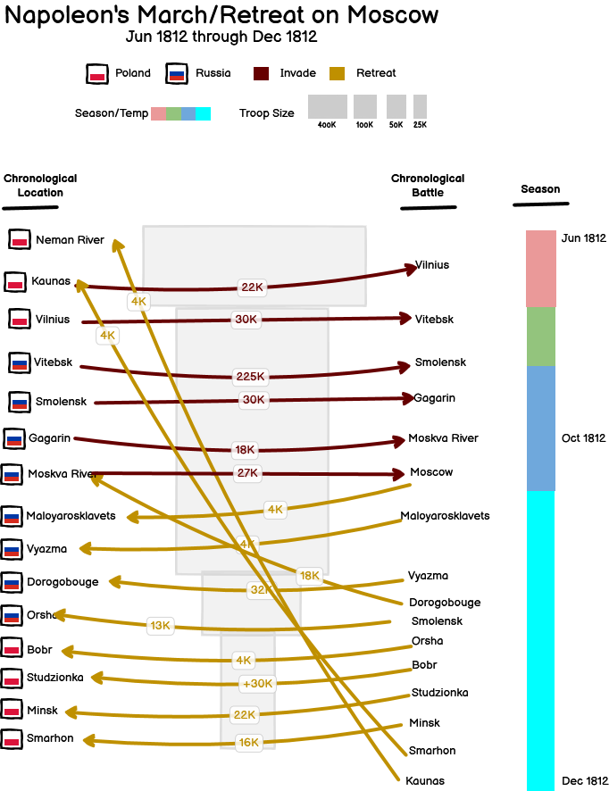
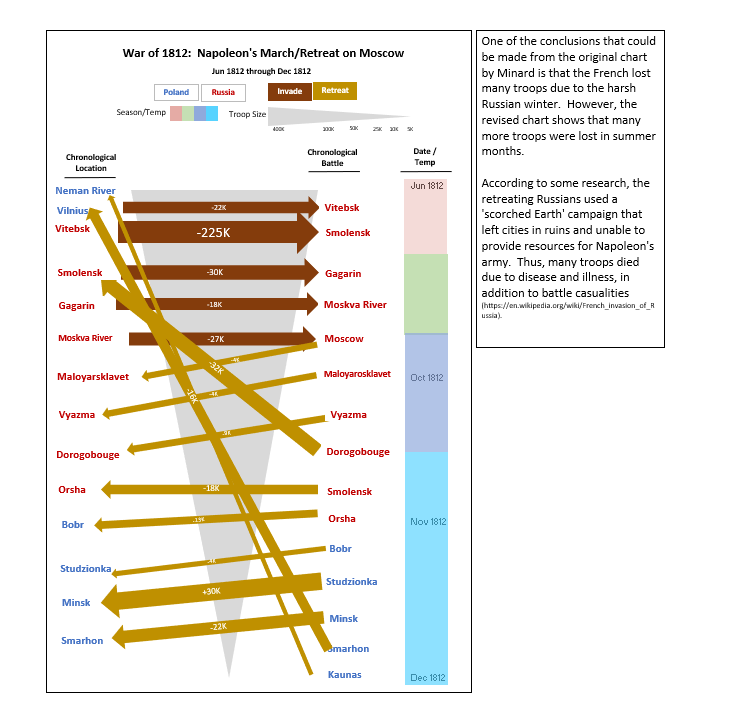

### Assignments Three and Four:  Critique and Visualization Re-Design
### Step 1: Find a Visualization
 
[Napoleon‘s March on Moscow Original Visualization by Minard](https://upload.wikimedia.org/wikipedia/commons/e/e2/Minard_Update.png)

### Step 2: Critique the Visualization
After some research, I was able to understand the information presented, but was not sure what the take-away was.  Clearly, Napoleon lost a lot of troops and found Moscow deserted, but why?  The visualization does not answer this question, it only provides partial clues.  I go into more detail in the Google critique form.

### Step 3: Wireframe a Solution
I think the original and my version are not great candidates for standard reporting tools.  I was able to use Balsamiq to create a mock-up, but there were limitations, like inability to change the thickness of the arrows to indicate troop losses/gains.  However, my sketch is below.
 

### Step 4: Test the Solution
I asked two people to provide feedback on my mock-up.  My mother-in_law and a fellow student.  My mother-in-law said I should represent the overall troop size and how it shrinks over time.  I did not have this in an earlier mock-up.  She also had some feedback on representing countries and time.

Brent, a classmate, provided some additional feedabck on using a triangle to represent overall troop size.  He also said I should reference the War of 1812.  Both reviewers mentioned that the arrows were not very informative without reference to troop losses/gains.  They both liked how I laid out the cities and battles chronologically, so that it helped the reader follow the invasion and retreat and better understand the purpose of the visualization. 

Both reviewers said this was better than the original.  I was pretty happy about that!

### Step 5: Buiid the Solution
I tried to build this visualization in Tableau using a Sankey template, but knew rather quickly it would not work.  Unfortunately, I had to mock this up in Excel.  Eventhough the visualization does not have that polished, Sankey flow of data, I did the best I could to show the troop losses/gains using the thickness of arrows and the invasion and retreat using color and direction.  My goal was to show clearly, the chronology of events, the results of the battles (troop counts), country of battles and seasonal/date information.  I decided to not use the country flags to indicate country for each city.  The flags were too similar, so I went with font color.  I also tried to use as few chart objects as possible, so the legend is simplified from the mock-up to use color as the legend item (versus showing labels also).

Originally, I was not planning on re-doing this 'the greatest infographic of all times' (Tufte), but I found many other charts just did not have that much data points.  I knew I would have a lot of options with this choice.  However, it was very challenging.  I had to learn a lot about the context behind the visualization in order to re-create it.  

[Back to Main Page](https://ajferrara.github.io/Telling.Stories.with.Data/)
