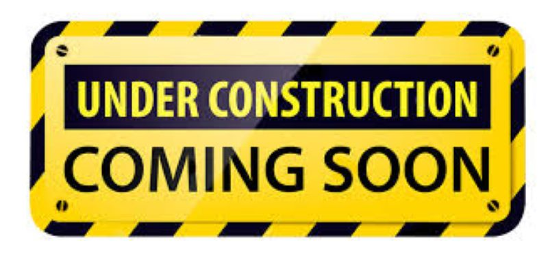

# Final Project | A.J. Ferrara | Fall 2020 | 94-870

 

## A high-level summary of your project
This should be a sentence or two that describes what you're interested in showing with your final project. \

There is a lot more interest in electric vehicles (EVs), so I am going to explore the reasons for the increased interest,  the obstacles that are preventing most people from buying them and showcase the key players and some resolutions to why EV adoption is slow.

A project structure that outlines the major elements of your story.  Your Good Charts text talks about story structure in Chapter 8 - you should describe the story arc that you hope to achieve.  

Talk about the anticipated call to action and outline your user stories.  

## Call to Action
Be more confident to make the switch from a gasoline-powered vehicle to an electricity-powered vehicle

## User Stories
Environmentally-conscious consumer \
Gas-powered vehicle owner \
Policy-makers \
Early adopters for new technology

## Outline 
Story arc, etc.

 Setup:  The increased interest in EVs (show sales over time) 
 
 Conflict:  Reasons for slower or no-adoption (battery range, cost...)
 
 Resolution:  Solutions to mitigate conflict

 
 

## Sketches

## Data
A couple of paragraphs that document the data and how it will be used 

recent article on global EV range by manufacturer and cost to the consumer  (https://www.visualcapitalist.com/range-evs-major-highway-routes/)

#### Setup
Growing climate change concerns (growing concerns around climate change)
Changes in commuting behaviors (https://electrek.co/2020/04/09/study-pandemic-lockdowns-are-encouraging-more-consumers-to-buy-electric-cars/) \
(https://www.smart-energy.com/industry-sectors/smart-energy/new-study-reveals-interesting-statistics-on-ev-ownership-and-consumer-interest/) \
(https://www.truecar.com/blog/which-generation-is-going-green/) \
EV Policy (https://www.nbcnews.com/science/environment/california-gov-signs-order-banning-sale-gasoline-powered-cars-2035-n1240878)
(https://www.theguardian.com/environment/2019/dec/25/2020-set-to-be-year-of-the-electric-car-say-industry-analysts)

#### Conflict
EV range and cost (https://www.fueleconomy.gov/) \
EV battery charge time (Audi recently rolled out a supercharger network that can charge its cars from 0% to 80% at a faster rate than Tesla) \
EV Infrastructure (???)

(https://wallbox.com/en_us/how-do-evs-compare-to-gas-cars)

#### Resolution
Growth in infrastructure (???) \
better range (???) \
Faster to charge batteries (???)

#### Call to Action
EV sales prediction (https://about.bnef.com/electric-vehicle-outlook/) 
EV sales (https://www.visualcapitalist.com/electric-vehicle-sales/) 

## Method and Medium
A few paragraphs documenting how the project will be completed. Platform for the final project identified.

[Back to Main Page](https://ajferrara.github.io/Telling.Stories.with.Data/)
