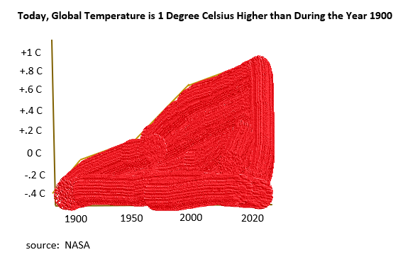

## Final Project Part 2 | A.J. Ferrara | Fall 2020 | 94-870   

## Title:  Electric Vehicles are Here to Stay and Save the Planet

## A high-level summary of your project
There is a lot more interest in electric vehicles (EVs), so I am going to explore the reasons for the increased interest,  the obstacles that are preventing many people from buying them and showcase the key manufacturers and some resolutions to address the low EV adoption.

## Call to Action
Be more confident to make the switch to an EV!

## User Stories
The user stories will address environmental, range and battery recharging and political benefits to EV ownership.

As an Environmentally-conscious consumer, I would like to understand how EVs are better for the environment.  
As a Gas-powered vehicle owner, I would like to understand now I can drive farther without anxiety.  
As a Policy-maker, I would like to understand how EVs are better for the United States and the environment.

## Outline 

**Setup:  There is an increase in EV sales due to several factors such as: climate change, innovative technology and policies.** 

**Conflict:  Mass adoption is slow due to range anxiety and cost.** 

**Resolution:  Solutions to mitigate and understand the conflict** 
 
 
## Sketches 

**Increased Sales** 
Global sales have been increasing year over year.  My mother and members of my extended family have recently purchased electric vehicles.  Tesla is all over the news with their cars and cyber truck.  I wonder why all the interest?
 

**There are pros and cons to adoption**  

 **Reasons for Increased Demand**

**Climate Change**  
A recent study has shown that electric vehicles can reduce hundreds of millions of carbon dioxide emissions, as well as prevent numerous premature deaths due to pullution (https://www.sciencedaily.com/releases/2020/08/200817123107.htm).  Since 1900, the atmopheric temperature has increase by one degree Celsius.  Most of the warming has occurred in the past forty years, with the six hottest years taking place since 2014 (https://climate.nasa.gov/evidence/).
 
 

**Innovative Technology**  
Electric vehicles are fast.  When you take off from a stop light, you feel like you are taking off in an airplane.   Electric vehicles have instant torque due to fewer moving parts and powerful battery (https://theconversation.com/heres-why-electric-cars-have-plenty-of-grunt-oomph-and-torque-115356).   They are also very quiet and very high-tech.  For example, when a driver walks to their Tesla, the door handles slide out!  
 
 

**Government Policies (Incentives)**  
The Federal Government provides tax credits from $7500 to help offset the higher electric vehicle cost, as well as promote technology that is good for the environment and good for the United States (local energy source) (https://www.caranddriver.com/research/a31267893/electric-vehicle-tax-credit/).

**Barriers to Adoption**

 Most people, when asked, will say they need much more range to drive their vehicle than they actually use.  This is known as 'range anxiety'.  

Range Anxiety --> more charging stations

Cost has been another barrier to EV adoption.  
 
 

**Barrier Resolutions**

As more manufacturers and models come onto the market, the driving range has dramatically increased.

To complement the longer range, more fast charging stations have been built around the country.

A big reason why EV sales increased is because battery prices have come down.

Close out with chart on benefits to the environment

## User Research and Interviews

a. the target audience you hope to reach with your story;   
Folks who may be unsure if an EV purchase is right for them.

b. your approach to identifying representative individuals to interview;  
c. your interview script;  
d. the findings from your interviews; and  
e. changes you plan on implementing to your visualizations next week to address the issues identified.  

## Data
I have found several articles that contain data and charts to help tell the story.  I will not use all articles, but I wanted a variety to choose from.

#### Setup
EV sales - show the significant and upward trend over time of EV US sales.
https://www-statista-com.proxy.library.cmu.edu/study/50929/electric-vehicles-in-the-us/  

Discuss why sales have been increasing: 

Climate Change - show how atmospheric carbon dioxide has been increasing over time.
https://climate.nasa.gov/evidence/  

Appeal of the technology -  
https://www.zeroto60times.com/browse-by-make/

Policies - 
 (https://www.nbcnews.com/science/environment/california-gov-signs-order-banning-sale-gasoline-powered-cars-2035-n1240878)  
 

#### Conflict
Review some articles that cover the barriers to adoption.
https://www.smart-energy.com/industry-sectors/smart-energy/new-study-reveals-interesting-statistics-on-ev-ownership-and-consumer-interest/  
https://www.truecar.com/blog/which-generation-is-going-green/  

EV range and cost 
https://www.fueleconomy.gov/  
https://evcharging.enelx.com/news/blog/512-electric-car-battery-life
https://chart-na1.emarketer.com/234301/perception-of-battery-electric-vehicles-bevs-among-us-adults-may-2019-of-respondents

EV Infrastructure 
https://chart-na1.emarketer.com/234301/perception-of-battery-electric-vehicles-bevs-among-us-adults-may-2019-of-respondents
(https://wallbox.com/en_us/how-do-evs-compare-to-gas-cars)

#### Resolution 
Avg Miles Driven is well within EV range 
https://www.fhwa.dot.gov/ohim/onh00/bar8.htm

Growth in infrastructure  
https://afdc.energy.gov/fuels/electricity_locations.html#/analyze?fuel=ELEC
https://evadoption.com/ev-charging-stations-statistics/

better range 
https://cds-frost-com.proxy.library.cmu.edu/p/55399#!/nts/c?id=9B18-00-63-00-00&hq=electric%20vehicle 

recent article on global EV range by manufacturer and cost to the consumer  
https://www.visualcapitalist.com/range-evs-major-highway-routes/
https://afdc.energy.gov/data/
https://www.energy.gov/eere/vehicles/articles/fotw-1064-january-14-2019-median-all-electric-vehicle-range-grew-73-miles

Faster to charge batteries  
https://www.pocket-lint.com/gadgets/news/130380-future-batteries-coming-soon-charge-in-seconds-last-months-and-power-over-the-air
https://www.atlasevhub.com/materials/state-ev-registration-data/

Testimonials   
https://cleanvehiclerebate.org/eng/ev/testimonials

#### Call to Action
Show a picture of a Tesla in nature

## Method and Medium
Shorthand will be used to build the story.  I would like to use compelling images behind the charts and words.  
I will also use Canva to build Infographics.  Some of the datapoints lend well to an infographic because the points may not be entirely related or in a quantity to show on a normal chart.  
Tableau or Flourish will be used to build the charts.

### References  
Landing Page Images  
https://unsplash.com/s/photos/mitchell-kmetz  
https://pxhere.com/en/photo/1028722

Last Page Image
https://www.flickr.com/photos/jurvetson/35446206643/

[Back to Main Page](https://ajferrara.github.io/Telling.Stories.with.Data/)

